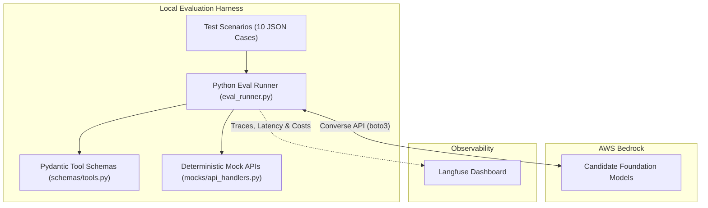
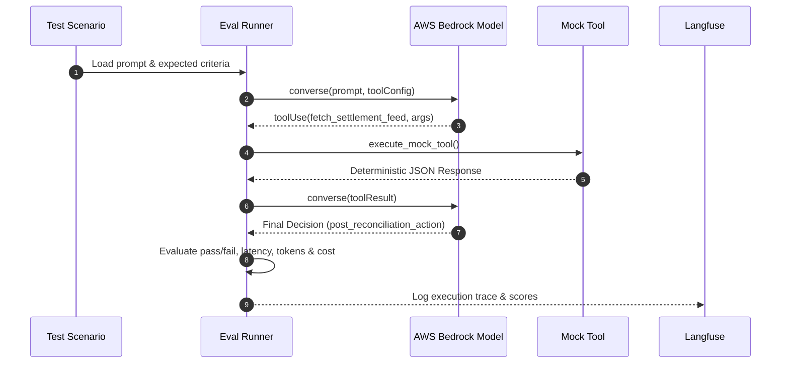

# Domain 01: Agentic AI & Tool Calling

**Owner / Evaluator:** Pritesh (@prit-ctl)  
**Jira Issue:** [IABA-6](https://aliuzer.atlassian.net/browse/IABA-6) / [IABA-8](https://aliuzer.atlassian.net/browse/IABA-8)  
**Topic:** Multi-System Reconciliation & Discrepancy Resolution  

---

## 1. What this Project Evaluates

This project benchmarks foundation models on **autonomous multi-turn tool calling, parameter fidelity, and error recovery** within an enterprise financial reconciliation workflow.

Models are evaluated on:
1. **Tool Selection Accuracy:** Calling the right tools in logical order.
2. **Schema & Argument Validity:** Adhering strictly to Pydantic parameter schemas without hallucinations.
3. **Task Outcome:** Arriving at the correct final financial reconciliation decision (`AUTO_MATCH`, `ADJUSTMENT_POSTED`, `ESCALATE_HUMAN`).
4. **Error Recovery:** Handling simulated upstream API 503 errors and missing IDs without crashing or inventing false balances.
5. **Latency & Economics:** Execution duration (p50/p95), token consumption, and projected cost per 1,000 transactions.

---

## 2. Architecture



### Execution Sequence



---

## 3. Technology Choices: Why and Why Not

- **Why AWS Bedrock?** Unified foundation model runtime via the standardized `converse()` API. Eliminates model-specific client libraries and vendor lock-in.
- **Why Langfuse?** Lightweight, open observability. Provides immediate visual trace inspection, latency tracking, and cost calculation with zero custom dashboard code.
- **Why LangChain / LangGraph / LangSmith are NOT used:**
  - **LangChain / LangGraph** add unnecessary abstraction layers, custom callback overhead, and version churn for a focused model bake-off. Plain Python + `boto3` is faster, simpler, and completely transparent.
  - **LangSmith** requires commercial vendor lock-in and a LangChain account.

---

## 4. Directory Structure

```text
domains/01-agentic-reconciliation/
├── README.md                  # This documentation
├── requirements.txt           # Minimal dependencies (boto3, pydantic, langfuse)
├── eval_runner.py             # Main evaluation runner script
├── test_eval.py               # Unit tests for schemas, mocks, and scoring
├── schemas/
│   └── tools.py               # 4 Pydantic v2 tool definitions & Bedrock schemas
├── mocks/
│   └── api_handlers.py        # Local deterministic mock API handlers
└── datasets/
    └── test_scenarios.json    # 10 curated evaluation test scenarios
```

---

## 5. Prerequisites & Environment Setup

### A. Python Environment
```bash
python3 -m venv .venv
source .venv/bin/activate
pip install -r requirements.txt
```

### B. AWS Credentials
Ensure your AWS profile or environment variables are configured:
```bash
export AWS_REGION="us-east-1"
export AWS_PROFILE="your-profile" # or standard AWS_ACCESS_KEY_ID / AWS_SECRET_ACCESS_KEY
```

### C. Langfuse (Optional)
If you want traces logged to your Langfuse project, set:
```bash
export LANGFUSE_PUBLIC_KEY="pk-lf-..."
export LANGFUSE_SECRET_KEY="sk-lf-..."
export LANGFUSE_HOST="https://cloud.langfuse.com"
```
*(If unset, the runner runs locally and gracefully skips remote logging).*

---

## 6. How to Run the Evaluation

### Run Unit Tests (Schemas, Mocks & Scoring Logic)
```bash
python -m unittest test_eval.py
```

### Run Evaluation in Local Mock Mode (Zero AWS Cost / Fast Sanity Check)
```bash
python eval_runner.py --mock
```

### Run Evaluation Against Live AWS Bedrock
```bash
python eval_runner.py anthropic.claude-sonnet-4-20250514-v1:0
```

### Compare Multiple Models
```bash
python eval_runner.py anthropic.claude-sonnet-4-20250514-v1:0 amazon.nova-lite-v1:0 meta.llama3-1-70b-instruct-v1:0
```

---

## 7. Metrics Explained

| Metric | Meaning | Target Threshold |
|:---|:---|:---:|
| **Accuracy (%)** | Proportion of scenarios where the model called all expected tools and took the correct action. | $\ge 90\%$ |
| **Avg Latency (ms)** | End-to-end execution time across multi-turn tool interaction turns. | $\le 2000\text{ ms}$ |
| **Cost / 1k Runs (\$)** | Projected production cost for 1,000 reconciliation runs based on token volume. | Budget dependent |
| **Error Recovery** | Ability to gracefully escalate 503 outages or unknown IDs without hallucinating balances. | $100\%$ |
